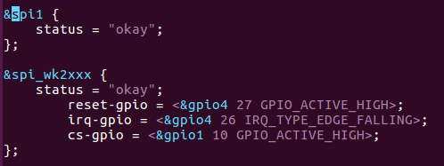

# AIO-RK3399C开发 #
- [下载源码](#下载源码)
- [根文件系统制作](#根文件系统制作)
- [UART配置](#UART配置)
- [固件打包](#固件打包)
- [Qt环境配置](./Qt/qt5.md)

[**官网资料下载**](http://www.t-firefly.com/doc/download/page/id/54.html)
## 下载源码 ##
- Rockchip原厂Buildroot项目: [https://github.com/rockchip-linux/buildroot](https://github.com/rockchip-linux/buildroot)  
- Buildroot官网: [https://buildroot.org](https://buildroot.org/)

### 下载repo工具 ###
    mkdir linux
    cd linux
    git clone https://github.com/FireflyTeam/repo.git

### 下载Linux-SDK ###
- 方法一

    	mkdir linux-sdk  
    	linux-sdk  
    
    	# 初始化repo仓库 
    	../repo/repo init --repo-url https://github.com/FireflyTeam/repo.git -u https://github.com/FireflyTeam/manifests.git -b linux-sdk -m rk3399/rk3399_linux_release.xml
    
    	# 同步源码  
    	../repo/repo sync -c 

- 方法二  

下载[Linux_SDK.7z](http://www.t-firefly.com/doc/download/page/id/54.html)

    	# 把压缩包放在上一步下载repo工具的目录下
    	7z x linux-sdk.7z
    	cd linux-sdk/
    
    	# 更新代码
    	./repo.sh

## 根文件系统制作 ##
- **[制作busybox镜像](./Buildroot/buildroot.md)**
- **[制作Ubuntu镜像](./Ubuntu/ubuntu1804.md)**

## Buildroot编译 ##
默认通过BusyBoxbian编译根文件系统，选择ubuntu需进行对应修改  
在Linux-SDK目录下copy制作好的Ubuntu镜像  
`mkdir ubuntufs`  
`cp rootfs.img ubunturootfs/`  

修改编译配置文件  
`vim vim device/rockchip/rk3399/aio-3399c.mk`  
RK_PARAMETER指向parameter-ubuntu.txt  
RK_ROOTFS_IMG指向ubuntu系统镜像路径即ubunturootfs/rootfs.img

parameter文件指定固件更新时各文件所烧写到的地址  
如parameter-ubuntu.txt  

  

**rootfs所烧写到的地址从0x0005a000开始到后面的所有位置，即单独更新rootfs只需把rootfs烧到0x0005a000这个地址上**

### 初始化编译 ###
`./build.sh aio-3399c.mk`  
执行成功aio-3399c.mk的内容会覆盖掉device/rockchip/.BoardConfig.mk的内容  
全编译  
`./build.sh`  

部分编译  
`./build.sh 参数`  

参数如下： 

## UART配置 ##
AIO-3399C 支持SPI桥接/扩展4个增强功能串口(UART)的功能，分别为UART1，UART2，RS232，RS485。每个UART都拥有256字节的FIFO缓冲区，用于数据接收和发送。

485使能  
`vim kernel/arch/arm64/boot/dts/rockchip/rk3399-firefly-port.dtsi`  

`vim kernel/arch/arm64/boot/dts/rockchip/rk3399-firefly-aioc.dts`  

## 固件打包 ##
### 更新链接 ###
为确保 rockdev/ 目录下文件链接正确，更新各部分镜像链接：  
`./mkfirmware.sh`

选择buildroot，rockdev目录下链接如下

选择Ubuntu，rockdev目录下链接如下

### 打包固件 ###
将 rockdev 目录的各部分镜像打包成固件 update.img：  
`./build.sh updateimg`  

打包好的固件所在目录为  
**IMAGE/RK3399-FIREFLY-AIOC_DATE_RELEASE_TEST/IMAGES/**   

**update.img**即为制作好的固件

## [Qt环境配置(PC环境Ubuntu1804)](./Qt/qt5.md) ##

